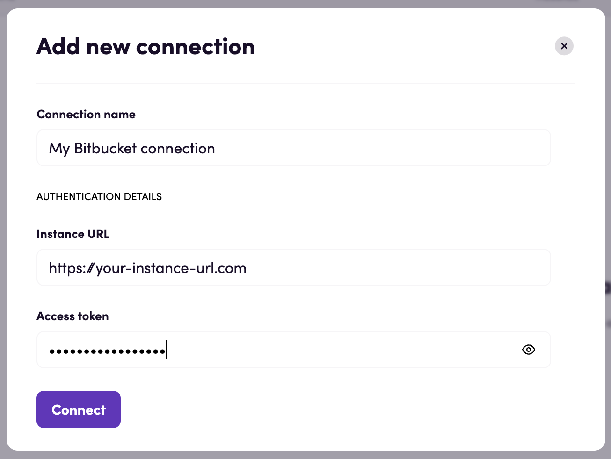

# Blackbird.io Bitbucket Data Center

Blackbird is the new automation backbone for the language technology industry. Blackbird provides enterprise-scale automation and orchestration with a simple no-code/low-code platform. Blackbird enables ambitious organizations to identify, vet and automate as many processes as possible. Not just localization workflows, but any business and IT process. This repository represents an application that is deployable on Blackbird and usable inside the workflow editor.

## Introduction

<!-- begin docs -->

Bitbucket Data Center is a self-managed solution that provides source code collaboration for professional teams of any size.

## Before setting up

Before you can connect, make sure you have an [HTTP access token](https://confluence.atlassian.com/bitbucketserver/personal-access-tokens-939515499.html) 
and make sure your Bitbucket Data Center instance is active.

When creating the token, grant it at least **Project read** and **Repository write** permissions.

## Connecting

1. Navigate to apps and search for Bitbucket Data Center. 
2. Click _Add connection_ and name your connection for future reference e.g. 'My Bitbucket connection'.
3. Input your instance URL and your HTTP access token.
4. Click _Connect_.

## Actions

### Files

- **Download file** Download a specific file from a repository
- **Upload file** Commit a file upload. Creates a new file or overwrites the existing one
- **Upload files** Commit multiple files, one commit per file. Creates new files or overwrites existing ones

## Feedback

Do you want to use this app or do you have feedback on our implementation? Reach out to us using the [established channels](https://www.blackbird.io/) or create an issue.

<!-- end docs -->
